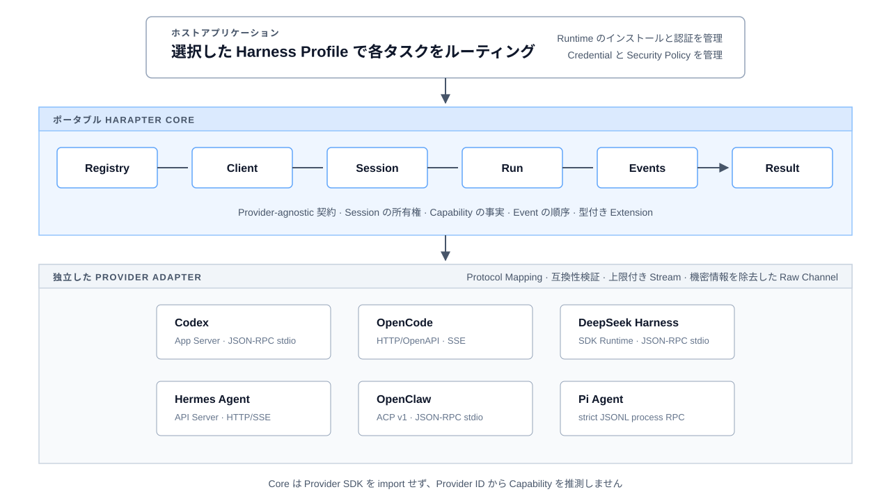

<!-- markdownlint-disable MD033 MD041 -->

<p align="center">
  
</p>

<h1 align="center">Harapter</h1>

<p align="center">
  <strong>複数の Agent Harness を利用するアプリケーション向けの、Provider に依存しない統一 TypeScript API。</strong><br>
  ホストは同一の Client、Session、Run、ストリーミング Event、Capability、Error ライフサイクルで各 Runtime を扱い、Adapter は Provider の状態所有権、観測した Capability、ネイティブ Extension を保持します。
</p>

<p align="center">
  <a href="./README.md">English</a> ·
  <a href="./README.zh-CN.md">简体中文</a> ·
  <a href="./README.ja.md">日本語</a> ·
  <a href="./docs/design/README.ja.md">設計</a> ·
  <a href="./examples/README.md">サンプル</a> ·
  <a href="./CONTRIBUTING.md">コントリビューション</a>
</p>

<p align="center">
  <a href="https://github.com/yunfeizhu/harapter/actions/workflows/ci.yml"></a>
  
  
  
  
  
  <a href="./LICENSE"></a>
  
</p>

<!-- markdownlint-enable MD033 -->

Harapter は、複数の Agent
Harness を利用するアプリケーション向けのオープンソース Adapter レイヤーです。ホストは Client、Session、Run、ストリーミング Event、Interaction、Capability、Error を 1 つの TypeScript 契約で扱い、独立した Provider
Adapter が公式 SDK やマシンプロトコルへ変換します。

これはアプリケーションと選択した Runtime の間に置く基盤であり、新しい Agent
Loop ではありません。各 Runtime の選択、インストール、認証、セキュリティは引き続きホストが管理します。

## クイックスタート

> Harapter の Package は pre-alpha の間は Private です。まずソース Workspace から評価してください。最初の公開リリースまでは
> `pnpm add @harapter/core` でインストールできません。

### 1. Workspace と Provider Runtime を準備する

Node.js 24 以降と Corepack を使用します。リポジトリは pnpm `11.23.0`
を固定しています。

```bash
git clone https://github.com/yunfeizhu/harapter.git
cd harapter
corepack enable
pnpm install --frozen-lockfile
pnpm build
```

[実装済み Adapter](./providers/README.md)を 1 つ選び、Provider のドキュメントに従って Runtime をインストールし、認証します。Harapter がホストの代わりに Runtime を検出、インストール、更新、ログインすることはありません。

### 2. 管理されている Single-Provider リファレンスを実行する

リファレンスアプリケーションは live evidence が記録済みの Codex
Adapter を使用します。ホストにインストール済みの `codex`
コマンドを明示的に指定します。

```bash
HARAPTER_CODEX_COMMAND=codex \
  pnpm --filter @harapter/example-single-provider start
```

この Entry Point は一時 Workspace を作成し、Read-only Sandbox で安定版 Codex App
Server を起動して、1 つの Ephemeral Session を実行します。Event
Stream を消費し、信頼できる Result を読み、すべてのリソースを Close します。小さな架空の Prompt を送信するため、Provider
Token を消費する場合があります。出力は安全なライフサイクルメタデータだけで、Prompt、Message 本文、Provider の Raw
Traffic、Credential、ローカルパスを含みません。

### 3. ポータブルなライフサイクルを組み込む

Composition
Root が Adapter と Profile を選択し、アプリケーション向けのライフサイクルは Provider に依存しません。

```ts
import { pathToFileURL } from 'node:url';
import {
  HarnessRegistry,
  profileId,
  type HarnessSession,
} from '@harapter/core';
import {
  CODEX_PROVIDER_ID,
  createCodexProviderFactory,
} from '@harapter/adapter-codex';

const registry = new HarnessRegistry();
registry.register(createCodexProviderFactory());

const client = await registry.connect({
  profileId: profileId('codex-local'),
  providerId: CODEX_PROVIDER_ID,
  displayName: 'Local Codex',
  connection: {
    kind: 'process',
    command: 'codex',
    args: ['app-server', '--stdio'],
    cwd: process.cwd(),
    ownership: 'adapter',
  },
  requiredCapabilities: [{ name: 'input.text' }, { name: 'run.stream' }],
});

let session: HarnessSession | undefined;

try {
  const descriptor = await client.descriptor();
  const capabilities = await client.capabilities();
  console.log({
    compatibility: descriptor.compatibility,
    streaming: capabilities.capabilities['run.stream']?.mode,
  });

  session = await client.createSession({
    workspace: { uri: pathToFileURL(process.cwd()).href },
    providerOptions: {
      approvalPolicy: 'never',
      sandbox: 'read-only',
      ephemeral: true,
    },
  });

  const run = await session.start(
    {
      parts: [
        {
          type: 'text',
          text: 'Reply with exactly HARAPTER_OK. Do not use tools.',
        },
      ],
    },
    { timeoutMs: 60_000 },
  );

  for await (const event of run.events()) {
    console.log({ sequence: event.sequence, type: event.type });
  }

  const result = await run.result();
  console.log({ status: result.status });
} finally {
  try {
    await session?.close();
  } finally {
    await client.close();
  }
}
```

別の Provider を選択しても、Registry → Client → Session → Run → Events →
Result のライフサイクルは変わりませんが、Adapter Factory、Provider ID、Profile
Connection、Provider-local
Option はその Provider 用に構成します。Session と Run の各入力や Control は、実行中の Runtime から観測した Capability
Manifest と対応する
[Provider README](./providers/README.md)に基づいて選択してください。ある Adapter が受け入れる Option は、別の Adapter では無効な場合があります。各 Provider
README は、正確な Runtime の前提条件、Connection 形式、互換性境界も所有します。

### 4. ライフサイクルの意味を明示的に扱う

- Provider 名を検査せず、Profile に `requiredCapabilities`
  を宣言します。Requirementは既定で `native`
  のみを受け入れ、弱い Mode の利用にはホストの明示的な判断が必要です。
- `run.events()`
  を継続的に消費します。Adapter は上限付き Buffer を使用し、未読の Run を Event の暗黙的な破棄ではなく Abort する場合があります。
- `run.result()` を信頼できる終端結果として扱います。`completed`、`cancelled`、
  `failed`、`connection_aborted` は異なる状態です。
- ホストの Authorization と Data Policy が許可する場合にのみ、
  `session.respond()` で `interaction.requested` を処理します。
- 現在の Capability Manifest が Resume をサポートする場合にのみ、`session.ref()`
  を不透明な Provider-owned
  State として保存します。元の Provider と Profile から Resume し、別の Adapter へ渡してはいけません。
- `providerState`、Provider Raw
  Event、`providerResult`、Credential、Prompt、Message 本文は既定で記録しません。Session と Client は必ず Close します。

## Harapter を使う理由

| 原則                               | ホストアプリケーションにとっての意味                                                                      |
| ---------------------------------- | --------------------------------------------------------------------------------------------------------- |
| **1 つのライフサイクル**           | オーケストレーションを一度実装し、タスクごとに Harness Profile を選択できます。                           |
| **状態には所有者があります**       | Session は、作成元の Provider、接続 Profile、ネイティブ状態に結び付いたままです。                         |
| **Capability は観測に基づきます**  | `native`、`emulated`、`adapter_controlled`、`unsupported`、`unknown` を明確に区別します。                 |
| **終端結果を正確に表現します**     | プロセスや接続の中断を、ネイティブな Run キャンセルや成功完了として扱いません。                           |
| **ネイティブ機能にも到達できます** | 型付き Extension と明示的な Native Escape Hatch により、ポータブルではない有用な動作も保持します。        |
| **未知の Event も観測できます**    | リソース上限を持ち機密情報を除去した Provider Channel に上流の変更を残し、成功 Event へ推測変換しません。 |

## アーキテクチャ

<!-- markdownlint-disable MD033 -->

<p align="center">
  
</p>

<!-- markdownlint-enable MD033 -->

Core は Provider SDK を import せず、Provider 名による分岐や Provider
ID による Capability 推測を行いません。プロトコル変換、互換性検証、リソース上限を持つ Transport、機密情報を除去した Fixture は各 Adapter が所有します。

### ポータビリティの境界

| Harapter が共通化するもの                                                  | Provider またはホストが引き続き所有するもの                                   |
| -------------------------------------------------------------------------- | ----------------------------------------------------------------------------- |
| Profile の選択と Adapter の動的登録                                        | Runtime のインストール、更新、認証、ライセンス                                |
| Client、Session、Run、順序付き Event Stream、信頼できる Terminal Result    | Agent Loop、Prompt、Model、Tool、Plugin、Skill、ネイティブ設定                |
| Capability Mode、ポータブルな Error、Interaction、ライフサイクル所有権検証 | ネイティブ Checkpoint、Provider ストレージ、サービス可用性                    |
| 型付き Provider Extension と明示的な Native Escape Hatch                   | ホストのタスク保存、Credential 解決、ホストアプリケーションの Security Policy |

## 実装済みモジュール

| 領域                 | Package とモジュール                                                                                                                                                                                                                                                                                    |
| -------------------- | ------------------------------------------------------------------------------------------------------------------------------------------------------------------------------------------------------------------------------------------------------------------------------------------------------- |
| **Portable API**     | [`@harapter/core`](./packages/core/README.md) — 契約、Registry、Capability Requirement、所有権検証、Error、Extension、Native Access                                                                                                                                                                     |
| **Conformance**      | [`@harapter/conformance`](./packages/conformance/README.md) — 再利用可能なポータブル動作スイートと決定論的 Fake Provider                                                                                                                                                                                |
| **Transport**        | [JSON-RPC stdio](./packages/transport-jsonrpc-stdio/README.md)、[strict JSONL process RPC](./packages/transport-jsonl-process/README.md)、[HTTP/SSE](./packages/transport-http-sse/README.md)、[ACP v1](./packages/transport-acp/README.md)                                                             |
| **Provider Adapter** | [Codex](./providers/codex/README.md)、[OpenCode](./providers/opencode/README.md)、[Claude](./providers/claude/README.md)、[DeepSeek Harness](./providers/dsh/README.md)、[Hermes Agent](./providers/hermes/README.md)、[OpenClaw](./providers/openclaw/README.md)、[Pi Agent](./providers/pi/README.md) |
| **リファレンス**     | [Single-Provider ライフサイクル](./examples/single-provider/README.md)と[並行 Multi-Provider Client](./examples/multi-provider-client/README.md)                                                                                                                                                        |

## サポートを宣言する前に証拠を揃える

マトリクスに行があるだけではサポートを意味しません。Harapter がインターフェースをソース上でサポート済みと表現するには、Adapter 実装、機密情報を除去した Fixture、Protocol
Mapping とライフサイクルテスト、Provider-negative テスト、共通 Conformance、明示的な互換性境界、live-runtime 証拠が必要です。

| Provider                                      | 公式インターフェース      | 現在の証拠ステータス                                                 |
| --------------------------------------------- | ------------------------- | -------------------------------------------------------------------- |
| [Codex](./providers/codex/README.md)          | stable App Server         | **ソース上でサポート** — Fixture、Conformance、互換性、live 証拠あり |
| [OpenCode](./providers/opencode/README.md)    | stable HTTP/OpenAPI + SSE | **ソース上でサポート** — Fixture、Conformance、互換性、live 証拠あり |
| [Claude](./providers/claude/README.md)        | Claude Agent SDK          | **ソース上で Experimental** — 決定論的証拠あり、live 証拠は未記録    |
| [DeepSeek Harness](./providers/dsh/README.md) | SDK Runtime JSON-RPC      | **ソース上で Experimental** — 決定論的証拠あり、live 証拠は未記録    |
| [Hermes Agent](./providers/hermes/README.md)  | API Server HTTP/SSE       | **ソース上で Experimental** — 決定論的証拠あり、live 証拠は未記録    |
| [OpenClaw](./providers/openclaw/README.md)    | ACP v1 bridge             | **ソース上で Experimental** — 決定論的証拠あり、live 証拠は未記録    |
| [Pi Agent](./providers/pi/README.md)          | strict JSONL RPC mode     | **ソース上で Experimental** — 決定論的証拠あり、live 証拠は未記録    |

「ソース上でサポート」はソース Adapter が保持する証拠を示すもので、公開 Package の保証ではありません。「ソース上で Experimental」は Adapter の実装と、宣言したインターフェースに対する決定論的テストは完了しているものの、必要な live-runtime 証拠がまだ記録されていない状態です。Harapter が証拠取得のために Runtime を自動インストールすることはありません。

Capability と互換性境界の詳細は、[Provider マトリクス（簡体字中国語）](./docs/design/provider-matrix.md)と各 Provider
README を参照してください。

## その他のサンプル

- [Single-Provider リファレンス](./examples/single-provider/README.md) — Client
  → Session → Run → Event →
  Result の完全なライフサイクルと安全な Cleanup を示します。
- [Multi-Provider リファレンス](./examples/multi-provider-client/README.md) —
  Profile
  Routing、並行 Stream、Session 単位の Control、所有権検証、明示的な Provider
  Extension 境界を示します。

2 つのリファレンスは既定で決定論的です。テストはサードパーティ Runtime の検出、インストール、認証、実行を行いません。ホストが Runtime 設定を明示的に指定した場合のみ、任意の Live
Entry Point が実行されます。

## プロジェクトの状態

Harapter は現在 **pre-alpha**
です。TypeScript 実装はこの Workspace から評価できますが、すべての Package は private
`0.0.0`
のままで、npm、PyPI、CLI の配布物はまだ公開されていません。最初の公開リリースは、API、Packaging、Provenance、Publishing、Rollback のレビュー後に行います。

現在は、利用者からのフィードバック、ホストが実行する Experimental
Adapter の Live Evidence、リリース準備に集中しています。Portable Wire
Schema、TypeScript 以外の SDK、Local-socket
Transport は、実際の利用者が必要とした時点で追加します。Goose、Qwen
Code、Crush、GitHub Copilot CLI、Cursor Agent CLI は現在の実装範囲外です。

## ドキュメント

| はじめに読むもの                                                               | 確認できる内容                                             |
| ------------------------------------------------------------------------------ | ---------------------------------------------------------- |
| [アーキテクチャと設計](./docs/design/README.ja.md)                             | システム境界、不変条件、契約、設計順序                     |
| [Portable Core 契約](./packages/core/README.md)                                | Public TypeScript API と所有権セマンティクス               |
| [Provider マトリクス（簡体字中国語）](./docs/design/provider-matrix.md)        | Provider ごとの Interface、Evidence、Capability ステータス |
| [Provider 実装ガイド（簡体字中国語）](./docs/design/provider-adapter-guide.md) | ポータブルな事実を弱めずに Adapter を構築する方法          |
| [開発ワークフロー](./docs/development.md)                                      | Toolchain、Branch、Validation、Review、Pull Request        |
| [コントリビューション](./CONTRIBUTING.md)                                      | Contribution の要件と Repository Workflow                  |
| [セキュリティポリシー](./SECURITY.md)                                          | Vulnerability の報告とサポート対象の Security Boundary     |
| [リリースポリシー](./RELEASING.md)                                             | Release Please、Versioning、公開準備                       |

## よくある質問

### Harapter は Agent Runtime をインストールまたは管理しますか？

いいえ。Runtime の選択、インストール、認証、Credential、ライセンス、Security
Policy はホストが管理します。

### Session を別の Provider や接続 Profile に移動できますか？

できません。Session は、作成元の Provider、Profile、不透明なネイティブ状態に結び付いたままです。作業を移すには新しい Session を作成する必要があり、Harapter は Checkpoint のポータビリティを意味しません。

### プロセスを切断すると Run はキャンセルされますか？

Provider がネイティブキャンセルを証明できる場合を除き、キャンセルされません。Transport
Abort と Provider が確認した Cancellation は異なるライフサイクル結果です。

### Experimental Adapter はプレースホルダーですか？

いいえ。実装、リソース上限と機密情報除去を備えた Fixture、Mapping とライフサイクルテスト、Provider-negative
Coverage、共通 Conformance、明示的な互換性境界が含まれます。Experimental ラベルは、決定論的な実装証拠ではなく live-runtime 証拠が不足していることを示します。

### Package が Private のままなのはなぜですか？

Public API がまだ pre-alpha だからです。Packaging、Provenance または Trusted
Publishing、Consumer Smoke Test、Rollback
Policy をまとめてレビューするまで Publishing は無効です。

## 対象外

Harapter は Agent Loop の実装、Provider
Runtime のインストールや更新、Harness 間のネイティブ Checkpoint 変換、ホストのタスク保存、Provider
Plugin Marketplace の管理、Credential の解決、ホストアプリケーションの Security
Policy の暗黙的な変更を行いません。

## ライセンス

[Apache License 2.0](./LICENSE) の下で提供されます。
