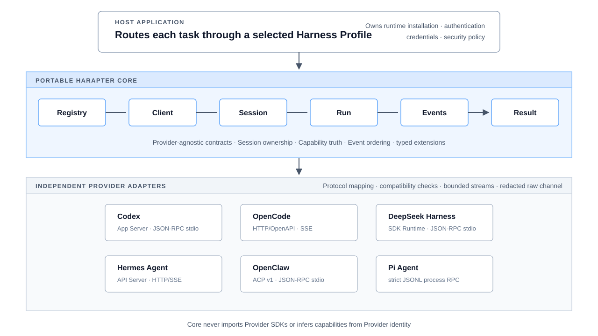

<!-- markdownlint-disable MD033 MD041 -->

<p align="center">
  
</p>

<h1 align="center">Harapter</h1>

<p align="center">
  <strong>One provider-agnostic TypeScript API for applications that orchestrate multiple agent harnesses.</strong><br>
  Use the same Client, Session, Run, streaming Event, Capability, and Error lifecycle across runtimes while each Adapter preserves Provider-owned state, observed capabilities, and native extensions.
</p>

<p align="center">
  <a href="./README.md">English</a> ·
  <a href="./README.zh-CN.md">简体中文</a> ·
  <a href="./README.ja.md">日本語</a> ·
  <a href="./docs/design/README.md">Design</a> ·
  <a href="./examples/README.md">Examples</a> ·
  <a href="./CONTRIBUTING.md">Contributing</a>
</p>

<p align="center">
  <a href="https://github.com/yunfeizhu/harapter/actions/workflows/ci.yml"></a>
  
  
  
  
  
  <a href="./LICENSE"></a>
  
</p>

<!-- markdownlint-enable MD033 -->

Harapter is an open-source adapter layer for applications that work with more
than one agent harness. The host uses one TypeScript contract for Clients,
Sessions, Runs, streaming Events, Interactions, Capabilities, and Errors;
independent Provider Adapters translate that contract to official SDKs and
machine protocols.

It is infrastructure between an application and its chosen runtimes—not a new
agent loop. The host still selects, installs, authenticates, and secures every
runtime it uses.

## Quick start

### 1. Install a release or prepare the source Workspace

Use Node.js 24 or newer with Corepack. The repository pins pnpm `11.23.0`.
Published pre-alpha packages use the opt-in `next` dist-tag:

```bash
pnpm add @harapter/core@next @harapter/adapter-codex@next
```

Registry availability begins with the first public release. If npm does not yet
report that release, or if you want to run the maintained reference
applications, use the source Workspace:

```bash
git clone https://github.com/yunfeizhu/harapter.git
cd harapter
corepack enable
pnpm install --frozen-lockfile
pnpm build
```

Choose one [implemented Adapter](./providers/README.md), then separately install
and authenticate its runtime according to that Provider's documentation.
Harapter does not discover, install, update, or sign in to a runtime for the
host.

### 2. Run the maintained single-Provider reference

The reference application uses Codex because that Adapter has recorded live
evidence. Supply a host-installed `codex` command explicitly:

```bash
HARAPTER_CODEX_COMMAND=codex \
  pnpm --filter @harapter/example-single-provider start
```

This creates a temporary workspace, launches the stable Codex App Server in a
read-only sandbox, runs one ephemeral Session, consumes its Event stream, reads
the authoritative Result, and closes every resource. It sends a small fictional
prompt and may consume Provider tokens. Output contains only safe lifecycle
metadata—never prompt or message bodies, raw Provider traffic, credentials, or
local paths.

### 3. Integrate the portable lifecycle

The composition root chooses an Adapter and Profile. The application-facing
lifecycle remains Provider-agnostic:

```ts
import { pathToFileURL } from 'node:url';
import {
  HarnessRegistry,
  profileId,
  type HarnessSession,
} from '@harapter/core';
import {
  CODEX_PROVIDER_ID,
  createCodexProviderFactory,
} from '@harapter/adapter-codex';

const registry = new HarnessRegistry();
registry.register(createCodexProviderFactory());

const client = await registry.connect({
  profileId: profileId('codex-local'),
  providerId: CODEX_PROVIDER_ID,
  displayName: 'Local Codex',
  connection: {
    kind: 'process',
    command: 'codex',
    args: ['app-server', '--stdio'],
    cwd: process.cwd(),
    ownership: 'adapter',
  },
  requiredCapabilities: [{ name: 'input.text' }, { name: 'run.stream' }],
});

let session: HarnessSession | undefined;

try {
  const descriptor = await client.descriptor();
  const capabilities = await client.capabilities();
  console.log({
    compatibility: descriptor.compatibility,
    streaming: capabilities.capabilities['run.stream']?.mode,
  });

  session = await client.createSession({
    workspace: { uri: pathToFileURL(process.cwd()).href },
    providerOptions: {
      approvalPolicy: 'never',
      sandbox: 'read-only',
      ephemeral: true,
    },
  });

  const run = await session.start(
    {
      parts: [
        {
          type: 'text',
          text: 'Reply with exactly HARAPTER_OK. Do not use tools.',
        },
      ],
    },
    { timeoutMs: 60_000 },
  );

  for await (const event of run.events()) {
    console.log({ sequence: event.sequence, type: event.type });
  }

  const result = await run.result();
  console.log({ status: result.status });
} finally {
  try {
    await session?.close();
  } finally {
    await client.close();
  }
}
```

When selecting another Provider, the Registry → Client → Session → Run → Events
→ Result lifecycle remains unchanged, while the Adapter Factory, Provider ID,
Profile connection, and Provider-local options change. Select every Session and
Run input or control from the observed Capability Manifest and the owning
[Provider README](./providers/README.md); an option accepted by one Adapter may
be invalid for another. Each Provider README also owns its exact runtime
prerequisites, connection shape, and compatibility boundary.

### 4. Handle lifecycle semantics explicitly

- Declare `requiredCapabilities` on a Profile instead of checking a Provider
  name. Requirements accept only `native` by default; weaker modes require an
  explicit host decision.
- Continuously consume `run.events()`. Adapters use bounded buffering and may
  abort an unread Run instead of silently dropping Events.
- Treat `run.result()` as the authoritative terminal outcome. `completed`,
  `cancelled`, `failed`, and `connection_aborted` are distinct states.
- Handle `interaction.requested` with `session.respond()` only under the host's
  authorization and data policy.
- Persist `session.ref()` as opaque Provider-owned state only when the active
  Capability Manifest supports resume. Resume it through the same Provider and
  Profile; never copy it to another Adapter.
- Do not log `providerState`, raw Provider Events, `providerResult`,
  credentials, prompts, or message bodies by default. Always close the Session
  and Client.

## Why Harapter

| Principle                           | What it means for a host application                                                                             |
| ----------------------------------- | ---------------------------------------------------------------------------------------------------------------- |
| **One lifecycle**                   | Build the orchestration flow once, then select a Harness Profile per task.                                       |
| **State has an owner**              | A Session stays bound to the Provider, connection Profile, and native state that created it.                     |
| **Capabilities are observed**       | `native`, `emulated`, `adapter_controlled`, `unsupported`, and `unknown` remain distinct.                        |
| **Terminal outcomes are honest**    | A process or connection abort never masquerades as native Run cancellation or successful completion.             |
| **Native behavior stays reachable** | Typed extensions and an explicit native escape hatch preserve useful behavior that is not portable.              |
| **Unknown events stay observable**  | Bounded, redacted Provider channels retain upstream changes without guessing them into a portable success event. |

## Architecture

<!-- markdownlint-disable MD033 -->

<p align="center">
  
</p>

<!-- markdownlint-enable MD033 -->

Core imports no Provider SDK, contains no Provider-name branches, and never
infers capability support from Provider identity. Adapters own protocol mapping,
compatibility checks, bounded transport behavior, and redacted fixtures.

### The portability boundary

| Harapter normalizes                                                             | The Provider or host still owns                                                      |
| ------------------------------------------------------------------------------- | ------------------------------------------------------------------------------------ |
| Profile selection and dynamic Adapter registration                              | Runtime installation, updates, authentication, and licensing                         |
| Client, Session, Run, ordered Event stream, and authoritative terminal Result   | Agent loops, prompts, models, tools, plugins, skills, and native configuration       |
| Capability modes, portable Errors, Interactions, and lifecycle ownership checks | Native checkpoints, Provider storage, and service availability                       |
| Typed Provider extensions plus a deliberate native escape hatch                 | Host task storage, credential resolution, and the host application's security policy |

## Implemented modules

| Area                  | Packages and modules                                                                                                                                                                                                                                                |
| --------------------- | ------------------------------------------------------------------------------------------------------------------------------------------------------------------------------------------------------------------------------------------------------------------- |
| **Portable API**      | [`@harapter/core`](./packages/core/README.md) — contracts, Registry, capability requirements, ownership checks, Errors, extensions, and native access                                                                                                               |
| **Conformance**       | [`@harapter/conformance`](./packages/conformance/README.md) — reusable portable behavior suite and deterministic Fake Provider                                                                                                                                      |
| **Transports**        | [JSON-RPC stdio](./packages/transport-jsonrpc-stdio/README.md), [strict JSONL process RPC](./packages/transport-jsonl-process/README.md), [HTTP/SSE](./packages/transport-http-sse/README.md), and [ACP v1](./packages/transport-acp/README.md)                     |
| **Provider Adapters** | [Codex](./providers/codex/README.md), [OpenCode](./providers/opencode/README.md), [DeepSeek Harness](./providers/dsh/README.md), [Hermes Agent](./providers/hermes/README.md), [OpenClaw](./providers/openclaw/README.md), and [Pi Agent](./providers/pi/README.md) |
| **References**        | [Single-Provider lifecycle](./examples/single-provider/README.md) and [concurrent multi-Provider client](./examples/multi-provider-client/README.md)                                                                                                                |

## Evidence before support

A matrix entry alone is not a support claim. An Adapter needs an implementation,
redacted fixtures, protocol mapping and lifecycle tests, Provider-negative
tests, shared conformance, a declared compatibility boundary, and live-runtime
evidence before Harapter describes the interface as supported in source.

| Provider                                      | Official interface        | Current evidence status                                                                         |
| --------------------------------------------- | ------------------------- | ----------------------------------------------------------------------------------------------- |
| [Codex](./providers/codex/README.md)          | stable App Server         | **Supported in source** — fixture, conformance, compatibility, and live evidence                |
| [OpenCode](./providers/opencode/README.md)    | stable HTTP/OpenAPI + SSE | **Supported in source** — fixture, conformance, compatibility, and live evidence                |
| [DeepSeek Harness](./providers/dsh/README.md) | SDK Runtime JSON-RPC      | **Experimental in source** — live evidence exists; Runtime compatibility is not negotiated      |
| [Hermes Agent](./providers/hermes/README.md)  | API Server HTTP/SSE       | **Experimental in source** — live-verified with 0.21.0; Runtime compatibility is not negotiated |
| [OpenClaw](./providers/openclaw/README.md)    | ACP v1 bridge             | **Supported in source** — fixture, conformance, compatibility, and live text Run evidence       |
| [Pi Agent](./providers/pi/README.md)          | strict JSONL RPC mode     | **Experimental in source** — live-verified with 0.84.4; Runtime compatibility is not negotiated |

“Supported in source” describes evidence held by the source Adapter, not a
published package guarantee. “Experimental in source” means the Adapter is
implemented and deterministically tested against its declared interface, but
either required live-runtime evidence is outstanding or the connected Runtime
cannot be matched safely to verified evidence. Harapter libraries never install
Provider runtimes in a host application. The trusted live-canary workflow may
install selected current runtimes only inside ephemeral GitHub-hosted jobs to
collect recurring evidence.

See the [Provider matrix](./docs/design/provider-matrix.md) and each Provider
README for exact capabilities and compatibility boundaries.

## More examples

- [Single-Provider reference](./examples/single-provider/README.md) shows a full
  Client → Session → Run → Event → Result lifecycle with safe cleanup.
- [Multi-Provider reference](./examples/multi-provider-client/README.md) shows
  Profile routing, concurrent streams, Session-level controls, ownership
  validation, and an explicit Provider-extension boundary.

Both references are deterministic by default: their tests do not discover,
install, authenticate, or invoke a third-party runtime. Optional live entry
points run only when the host supplies an explicit runtime configuration.

## Project status

Harapter is **pre-alpha**. The TypeScript implementation is available from this
Workspace, and public-release candidates have reviewed manifests, tarball
consumer checks, provenance, publishing, and rollback controls. Released
pre-alpha npm packages use one synchronized version and the opt-in `next`
dist-tag; check npm or the GitHub Releases page for current registry
availability. The Workspace root and examples remain private, and Harapter does
not publish a PyPI or standalone CLI distribution.

Current stabilization work focuses on consumer feedback, host-operated live
evidence for experimental Adapters, and release readiness. Portable wire
schemas, non-TypeScript SDKs, and a local-socket transport will be added when a
real consumer requires them. Goose, Qwen Code, Crush, GitHub Copilot CLI, and
Cursor Agent CLI are outside the current implementation scope.

## Documentation

| Start here                                                               | Use it for                                                    |
| ------------------------------------------------------------------------ | ------------------------------------------------------------- |
| [Architecture and target design](./docs/design/README.md)                | System boundaries, invariants, contracts, and design sequence |
| [Portable Core contract](./packages/core/README.md)                      | Public TypeScript API and ownership semantics                 |
| [Provider matrix](./docs/design/provider-matrix.md)                      | Per-Provider interface, evidence, and capability status       |
| [Provider implementation guide](./docs/design/provider-adapter-guide.md) | Building an Adapter without weakening portable truth          |
| [Development workflow](./docs/development.md)                            | Toolchain, branches, validation, review, and pull requests    |
| [Contributing](./CONTRIBUTING.md)                                        | Contribution expectations and repository workflow             |
| [Security policy](./SECURITY.md)                                         | Reporting vulnerabilities and supported security boundaries   |
| [Release policy](./RELEASING.md)                                         | Release Please, versioning, and publication readiness         |

## Frequently asked questions

### Does Harapter install or manage agent runtimes?

No. Runtime selection, installation, authentication, credentials, licensing, and
security policy remain host responsibilities.

### Can a Session move between Providers or connection Profiles?

No. A Session remains bound to its creating Provider, Profile, and opaque native
state. Moving work requires creating a new Session; Harapter does not imply
checkpoint portability.

### Does disconnecting a process cancel a Run?

Not unless the Provider proves native cancellation. A transport abort and a
Provider-acknowledged cancellation are different lifecycle outcomes.

### Are experimental Adapters placeholders?

No. They include implementations, bounded and redacted fixtures, mapping and
lifecycle tests, Provider-negative coverage, shared conformance, and declared
compatibility boundaries. The experimental label records an unresolved
live-evidence or Runtime-compatibility probe boundary rather than missing
deterministic implementation evidence.

### How are packages versioned and published?

Public Core, conformance, transport, and Adapter packages move together on one
pre-1.0 version and publish under `next`. The Workspace root and examples stay
private. Release Please owns versions and GitHub Releases; a separately
authorized workflow publishes the immutable release to npm with provenance.

## Non-goals

Harapter does not implement an agent loop, install or update Provider runtimes,
translate native checkpoints between harnesses, own host task storage, manage
Provider plugin marketplaces, resolve credentials, or silently change a host
application's security policy.

## License

Licensed under the [Apache License 2.0](./LICENSE).
