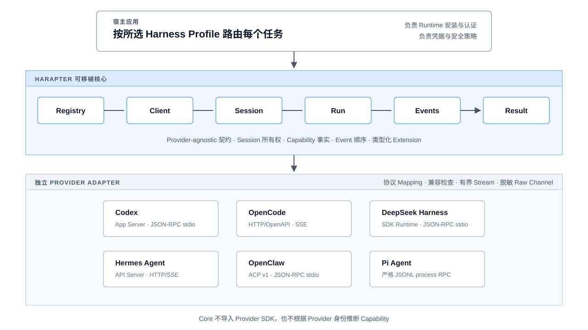

<!-- markdownlint-disable MD033 MD041 -->

<p align="center">
  
</p>

<h1 align="center">Harapter</h1>

<p align="center">
  <strong>为需要接入多个 Agent Harness 的应用提供一套与 Provider 无关的统一 TypeScript API。</strong><br>
  宿主使用同一套 Client、Session、Run、流式 Event、Capability 和 Error 生命周期编排不同 Runtime；各 Adapter 仍保留 Provider 的状态所有权、已观测 Capability 与原生 Extension。
</p>

<p align="center">
  <a href="./README.md">English</a> ·
  <a href="./README.zh-CN.md">简体中文</a> ·
  <a href="./README.ja.md">日本語</a> ·
  <a href="./docs/design/README.zh-CN.md">设计</a> ·
  <a href="./examples/README.md">示例</a> ·
  <a href="./CONTRIBUTING.md">贡献</a>
</p>

<p align="center">
  <a href="https://github.com/yunfeizhu/harapter/actions/workflows/ci.yml"></a>
  
  
  
  
  
  <a href="./LICENSE"></a>
  
</p>

<!-- markdownlint-enable MD033 -->

Harapter 是一个面向多 Agent
Harness 应用的开源适配层。宿主使用一套 TypeScript 契约处理 Client、Session、Run、流式 Event、Interaction、Capability 和 Error；独立的 Provider
Adapter 将这些契约转换到官方 SDK 和机器协议。

它位于应用与所选 Runtime 之间，是基础设施，而不是新的 Agent
Loop。每个 Runtime 仍由宿主选择、安装、认证并实施安全策略。

## 快速上手

> Harapter 的 Package 在 pre-alpha 阶段仍为 Private。请先通过源码 Workspace 评估；首个公开版本发布前，不能使用
> `pnpm add @harapter/core` 安装。

### 1. 准备 Workspace 和 Provider Runtime

使用 Node.js 24 或更高版本与 Corepack。仓库固定使用 pnpm `11.23.0`。

```bash
git clone https://github.com/yunfeizhu/harapter.git
cd harapter
corepack enable
pnpm install --frozen-lockfile
pnpm build
```

从[已实现 Adapter](./providers/README.md)中选择一个，并按照对应 Provider 文档安装和认证 Runtime。Harapter 不会替宿主发现、安装、更新 Runtime，也不会执行登录。

### 2. 运行维护中的单 Provider 参考实现

参考实现使用已有真实运行证据的 Codex Adapter。请显式提供宿主已经安装的 `codex`
命令：

```bash
HARAPTER_CODEX_COMMAND=codex \
  pnpm --filter @harapter/example-single-provider start
```

这个入口会创建临时 Workspace，在只读 Sandbox 中启动稳定的 Codex App
Server，运行一个临时 Session，消费 Event
Stream，读取权威 Result，并关闭全部资源。它会发送一条虚构的小型 Prompt，可能消耗 Provider
Token。输出只包含安全的生命周期元数据，不包含 Prompt、消息正文、Provider 原始流量、凭据或本地路径。

### 3. 接入可移植生命周期

组合根负责选择 Adapter 和 Profile；面向应用的生命周期不依赖具体 Provider：

```ts
import { pathToFileURL } from 'node:url';
import {
  HarnessRegistry,
  profileId,
  type HarnessSession,
} from '@harapter/core';
import {
  CODEX_PROVIDER_ID,
  createCodexProviderFactory,
} from '@harapter/adapter-codex';

const registry = new HarnessRegistry();
registry.register(createCodexProviderFactory());

const client = await registry.connect({
  profileId: profileId('codex-local'),
  providerId: CODEX_PROVIDER_ID,
  displayName: 'Local Codex',
  connection: {
    kind: 'process',
    command: 'codex',
    args: ['app-server', '--stdio'],
    cwd: process.cwd(),
    ownership: 'adapter',
  },
  requiredCapabilities: [{ name: 'input.text' }, { name: 'run.stream' }],
});

let session: HarnessSession | undefined;

try {
  const descriptor = await client.descriptor();
  const capabilities = await client.capabilities();
  console.log({
    compatibility: descriptor.compatibility,
    streaming: capabilities.capabilities['run.stream']?.mode,
  });

  session = await client.createSession({
    workspace: { uri: pathToFileURL(process.cwd()).href },
    providerOptions: {
      approvalPolicy: 'never',
      sandbox: 'read-only',
      ephemeral: true,
    },
  });

  const run = await session.start(
    {
      parts: [
        {
          type: 'text',
          text: 'Reply with exactly HARAPTER_OK. Do not use tools.',
        },
      ],
    },
    { timeoutMs: 60_000 },
  );

  for await (const event of run.events()) {
    console.log({ sequence: event.sequence, type: event.type });
  }

  const result = await run.result();
  console.log({ status: result.status });
} finally {
  try {
    await session?.close();
  } finally {
    await client.close();
  }
}
```

切换到其他 Provider 后，Registry → Client → Session → Run → Events →
Result 生命周期保持不变，但需要配置对应的 Adapter Factory、Provider ID、Profile
Connection 和 Provider-local
Option。Session 和 Run 的每项输入或控制都必须根据当前运行时观测到的 Capability
Manifest 与对应的
[Provider README](./providers/README.md)选择；一个 Adapter 接受的 Option 对另一个 Adapter 可能无效。每份 Provider
README 还负责记录准确的 Runtime 前置条件、Connection 结构和兼容边界。

### 4. 显式处理生命周期语义

- 在 Profile 中声明
  `requiredCapabilities`，不要检查 Provider 名称。Requirement 默认只接受
  `native`；使用较弱 Mode 必须由宿主显式决定。
- 持续消费
  `run.events()`。Adapter 使用有界 Buffer，未读取的 Run 可能被中止，不会静默丢弃 Event。
- 把 `run.result()` 作为权威终态。`completed`、`cancelled`、`failed` 和
  `connection_aborted` 是不同状态。
- 只有在宿主授权和数据策略允许时，才使用 `session.respond()` 处理
  `interaction.requested`。
- 仅当当前 Capability Manifest 支持 Resume 时，才把 `session.ref()`
  作为不透明的 Provider-owned
  State 持久化。必须通过原 Provider 和 Profile 恢复，不能复制给其他 Adapter。
- 默认不要记录 `providerState`、Provider Raw
  Event、`providerResult`、凭据、Prompt 或消息正文。始终关闭 Session 和 Client。

## 为什么选择 Harapter

| 原则                    | 对宿主应用的含义                                                                      |
| ----------------------- | ------------------------------------------------------------------------------------- |
| **一套生命周期**        | 编写一次编排流程，再为每个任务选择 Harness Profile。                                  |
| **状态有明确的所有者**  | Session 始终绑定创建它的 Provider、连接 Profile 和原生状态。                          |
| **Capability 来自观测** | `native`、`emulated`、`adapter_controlled`、`unsupported` 和 `unknown` 保持明确区分。 |
| **如实表达终态**        | 进程或连接中止不会伪装成 Provider 原生 Run 取消或成功完成。                           |
| **原生能力仍然可达**    | 类型化 Extension 和显式 Native Escape Hatch 保留无法移植但仍有价值的行为。            |
| **未知事件仍然可观测**  | 有界、脱敏的 Provider Channel 保留上游变化，不把未知事件猜测为可移植的成功事件。      |

## 架构

<!-- markdownlint-disable MD033 -->

<p align="center">
  
</p>

<!-- markdownlint-enable MD033 -->

Core 不导入 Provider
SDK，不根据 Provider 名称分支，也不根据 Provider 身份推断 Capability。协议映射、兼容检查、有界 Transport 行为和脱敏 Fixture 由各 Adapter 负责。

### 可移植边界

| Harapter 统一处理                                               | Provider 或宿主继续负责                                   |
| --------------------------------------------------------------- | --------------------------------------------------------- |
| Profile 选择与 Adapter 动态注册                                 | Runtime 安装、更新、认证和许可证                          |
| Client、Session、Run、有序 Event Stream 和权威 Terminal Result  | Agent Loop、Prompt、Model、Tool、Plugin、Skill 和原生配置 |
| Capability Mode、可移植 Error、Interaction 和生命周期所有权检查 | 原生 Checkpoint、Provider 存储和服务可用性                |
| 类型化 Provider Extension 和显式 Native Escape Hatch            | 宿主任务存储、凭据解析和宿主应用的安全策略                |

## 已实现模块

| 范围                 | Package 与模块                                                                                                                                                                                                                                                                                            |
| -------------------- | --------------------------------------------------------------------------------------------------------------------------------------------------------------------------------------------------------------------------------------------------------------------------------------------------------- |
| **Portable API**     | [`@harapter/core`](./packages/core/README.md)——契约、Registry、Capability Requirement、所有权检查、Error、Extension 和 Native Access                                                                                                                                                                      |
| **Conformance**      | [`@harapter/conformance`](./packages/conformance/README.md)——可复用的可移植行为套件和确定性 Fake Provider                                                                                                                                                                                                 |
| **Transport**        | [JSON-RPC stdio](./packages/transport-jsonrpc-stdio/README.md)、[严格 JSONL process RPC](./packages/transport-jsonl-process/README.md)、[HTTP/SSE](./packages/transport-http-sse/README.md) 和 [ACP v1](./packages/transport-acp/README.md)                                                               |
| **Provider Adapter** | [Codex](./providers/codex/README.md)、[OpenCode](./providers/opencode/README.md)、[Claude](./providers/claude/README.md)、[DeepSeek Harness](./providers/dsh/README.md)、[Hermes Agent](./providers/hermes/README.md)、[OpenClaw](./providers/openclaw/README.md) 和 [Pi Agent](./providers/pi/README.md) |
| **参考实现**         | [单 Provider 生命周期](./examples/single-provider/README.md)与[并发多 Provider Client](./examples/multi-provider-client/README.md)                                                                                                                                                                        |

## 先有证据，再声明支持

矩阵里的一行并不代表已经支持。Adapter 必须具备实现、脱敏 Fixture、协议 Mapping 与生命周期测试、Provider-negative 测试、公共 Conformance、明确的兼容边界和真实 Runtime 证据，Harapter 才会把该接口描述为源码级支持。

| Provider                                      | 官方接口                | 当前证据状态                                                  |
| --------------------------------------------- | ----------------------- | ------------------------------------------------------------- |
| [Codex](./providers/codex/README.md)          | 稳定 App Server         | **源码级支持**——具备 Fixture、Conformance、兼容与真实运行证据 |
| [OpenCode](./providers/opencode/README.md)    | 稳定 HTTP/OpenAPI + SSE | **源码级支持**——具备 Fixture、Conformance、兼容与真实运行证据 |
| [Claude](./providers/claude/README.md)        | Claude Agent SDK        | **源码级实验**——具备确定性证据，尚缺真实运行证据              |
| [DeepSeek Harness](./providers/dsh/README.md) | SDK Runtime JSON-RPC    | **源码级实验**——具备确定性证据，尚缺真实运行证据              |
| [Hermes Agent](./providers/hermes/README.md)  | API Server HTTP/SSE     | **源码级实验**——具备确定性证据，尚缺真实运行证据              |
| [OpenClaw](./providers/openclaw/README.md)    | ACP v1 Bridge           | **源码级实验**——具备确定性证据，尚缺真实运行证据              |
| [Pi Agent](./providers/pi/README.md)          | 严格 JSONL RPC 模式     | **源码级实验**——具备确定性证据，尚缺真实运行证据              |

“源码级支持”描述源码 Adapter 所持有的证据，不是已发布 Package 的保证。“源码级实验”表示 Adapter 已经实现，并按声明的接口完成确定性测试，但尚未记录所需的真实 Runtime 证据。Harapter 不会为了获取这些证据自动安装 Runtime。

准确的 Capability 和兼容边界请查看
[Provider 接入矩阵](./docs/design/provider-matrix.zh-CN.md)与各 Provider
README。

## 更多示例

- [单 Provider 参考实现](./examples/single-provider/README.md)展示完整的 Client
  → Session → Run → Event → Result 生命周期及安全清理。
- [多 Provider 参考实现](./examples/multi-provider-client/README.md)展示 Profile 路由、并发事件流、Session 级控制项、所有权验证和显式 Provider
  Extension 边界。

两份参考实现默认都保持确定性：测试不会发现、安装、认证或调用第三方 Runtime。只有宿主显式提供 Runtime 配置时，可选的 Live 入口才会运行。

## 项目状态

Harapter 当前处于
**pre-alpha**。TypeScript 实现可以从本 Workspace 用于评估，但所有 Package 仍为 private
`0.0.0`；尚未发布 npm、PyPI 或 CLI 发行物。首个公开版本会在 API、打包、来源证明、发布流程和回滚方案完成审查后发布。

当前稳定化工作聚焦于消费者反馈、由宿主运行的实验 Adapter Live
Evidence 和发布准备。Portable Wire Schema、非 TypeScript SDK 和 Local-socket
Transport 会在出现真实消费者需求时实现。Goose、Qwen Code、Crush、GitHub Copilot
CLI 和 Cursor Agent CLI 不在当前实现范围内。

## 文档导航

| 从这里开始                                                         | 适合了解                                   |
| ------------------------------------------------------------------ | ------------------------------------------ |
| [架构与目标设计](./docs/design/README.zh-CN.md)                    | 系统边界、不变量、契约和设计顺序           |
| [Portable Core 契约](./packages/core/README.md)                    | 公共 TypeScript API 与所有权语义           |
| [Provider 接入矩阵](./docs/design/provider-matrix.zh-CN.md)        | 各 Provider 的接口、证据与 Capability 状态 |
| [Provider 实现指南](./docs/design/provider-adapter-guide.zh-CN.md) | 在不削弱可移植事实的前提下构建 Adapter     |
| [开发流程](./docs/development.md)                                  | 工具链、分支、验证、Review 与 Pull Request |
| [贡献指南](./CONTRIBUTING.md)                                      | 贡献要求与仓库流程                         |
| [安全策略](./SECURITY.md)                                          | 漏洞报告与受支持的安全边界                 |
| [发布策略](./RELEASING.md)                                         | Release Please、版本与发布准备             |

## 常见问题

### Harapter 会安装或管理 Agent Runtime 吗？

不会。Runtime 的选择、安装、认证、凭据、许可证和安全策略仍由宿主负责。

### Session 可以切换 Provider 或连接 Profile 吗？

不可以。Session 始终绑定创建它的 Provider、Profile 和不透明原生状态。迁移任务需要创建新的 Session；Harapter 不暗示 Checkpoint 可移植。

### 断开进程连接等于取消 Run 吗？

除非 Provider 能证明原生取消，否则不等于。Transport
Abort 与 Provider 确认的 Cancellation 是不同的生命周期结果。

### 实验 Adapter 只是占位实现吗？

不是。它们具备实现、有界且脱敏的 Fixture、Mapping 与生命周期测试、Provider-negative 覆盖、公共 Conformance 和明确兼容边界。实验标签记录的是缺少真实 Runtime 证据，而不是缺少确定性实现证据。

### 为什么 Package 仍是 Private？

公共 API 仍处于 pre-alpha。只有 Package、Provenance 或 Trusted
Publishing、消费者 Smoke Test 和回滚策略完成联合审查后，才会启用发布。

## 明确不做什么

Harapter 不实现 Agent Loop，不安装或更新 Provider
Runtime，不在 Harness 之间转换原生 Checkpoint，不接管宿主任务存储，不管理 Provider
Plugin Marketplace，不解析凭据，也不会静默修改宿主应用的安全策略。

## 许可证

项目使用 [Apache License 2.0](./LICENSE)。
